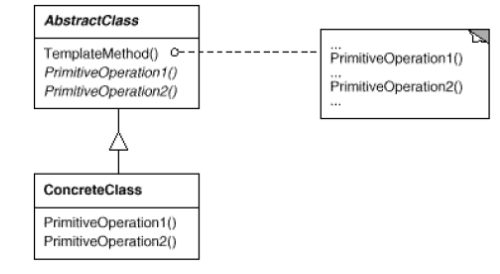
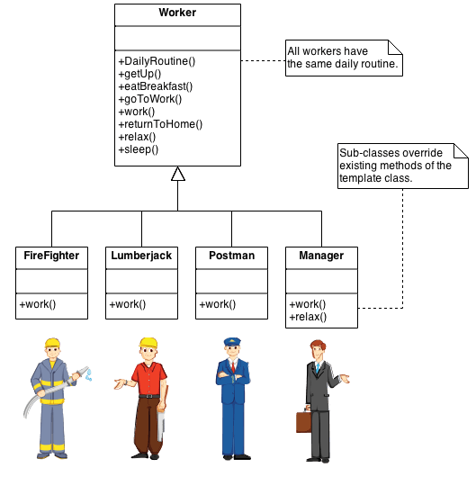

# Template Method
Define um esqueleto de um algoritmo que utiliza métodos abstratos que serão implementados posteriormente na classe concreta.



## Exemplo de uso
O Template Method define um esqueleto de um algoritmo em uma operação e adia algumas etapas para subclasses. Por exemplo, construtores de residências podem usar este padrão para criar uma nova subdivisão. Uma subdivisão típica consiste em um número limitado de plantas baixas com diferentes variações disponíveis para cada uma. Dentro de uma planta baixa, a fundação, estrutura, encanamento e fiação serão idênticos para cada casa. A variação é introduzida nos estágios posteriores da construção para produzir uma variedade maior de modelos.

Um outro exemplo: a rotina diária de um(a) trabalhador(a).




## Aplicabilidades
- A classe ```java.io.InputStream``` da linguagem Java possui um método ```read()```, que lê um inteiro de um *stream* (não sabemos qual tipo de *stream*. Pode ser de um arquivo, da entrada padrão, da rede, etc.). Alguns métodos da própria classe utilizam o ```read``` (mesmo ele
não estando implementado). As subclasses concretas (ex: ```FileInputStream```,```SocketInputStream```, etc) implementam o método ```read()``` da forma adequada (mas não precisam implementar todos os outros métodos).

```java
//Metodo abstrato read()
    public abstract int read() throws IOException;
        //Método concreto que utiliza o read()
        public int read(byte b[], int off, int len) throws IOException {
            ......
            int c = read();
            if (c == -1) {
            return -1;
        }

        b[off] = (byte) c;

        int i = 1;
        try {
            for (; i < len ; i++) {
                c = read();
                if (c == -1) {
                    break;
                }
            }
        }
    .....
    }
```
