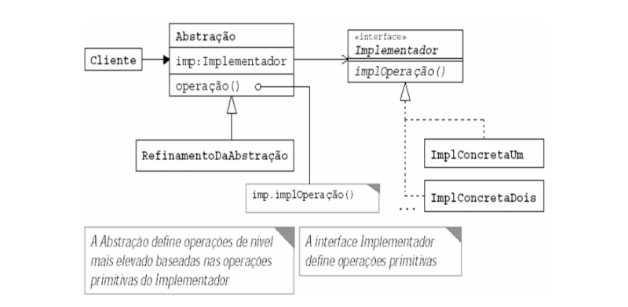
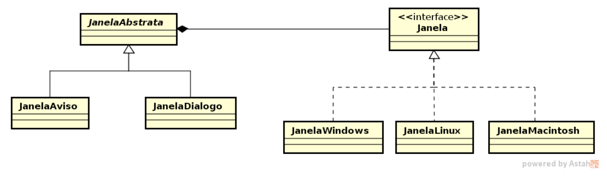

# Bridge
Desacopla uma abstração de sua implementação, de forma que as duas possam variar independentemente. Um <strong>interruptor</strong>, que controla luzes, ventiladores de teto, etc, é um exemplo de bridge. O objetivo do interruptor é ligar ou desligar um dispositivo. O padrão bridge divide a lógica de negócio ou uma enorme classe em hierarquias de classe separadas que podem ser desenvolvidas ou variadas independentemente.

Uma dessas hierarquias (chamada de <strong>abstração</strong>) obterá uma referência a um objeto da segunda hierarquia (<strong>implementação</strong>). A abstração poderá delegar algumas de suas chamadas (às vezes, a maioria) para o objeto de implementações. Como todas as implementações terão uma interface comum, elas seriam intercambiáveis dentro da abstração.

## Problema
Suponha agora que é necessário fazer um programa que deva funcionar em várias plataformas (por exemplo, Windows, Linux, Mac, etc). O programa fará uso de diversas abstrações de janelas gráficas, por exemplo, janela de diálogo, janela de aviso, janela de erro, etc. Essas abstrações são conceitos de janelas compostas por vários componentes como botões, rótulos e painéis.

Como podemos representar esta situação? A utilização de um adapter para adaptar as janelas para as diversas plataformas parece ser boa, criaríamos um Adapter para Windows, Linux e Mac e então utilizaríamos de acordo com a necessidade. No entanto teríamos que utilizar o adaptador de cada uma das plataforma para cada um dos tipos de abstrações de janelas. Por exemplo, para uma janela de diálogo, teríamos um Adapter para Windows, Linux e Mac, da mesma forma para as outras janelas.

Esta solução tem problemas:
* Torna o <strong>código do cliente dependente de plataforma</strong>, o que dificulta sua portabilidade para outras plataformas.

* Amarra na mesma hierarquia a abstração e a implementação.

* Elas não podem variar de forma independente

* Dificulta o reuso da abstração e o reuso da implementação

## Solução
O Padrão Bridge tem como intenção “Desacoplar uma abstração da sua implementação, de modo que as duas possam variar independentemente”. Ou seja, o Bridge fornece um nível de abstração maior que o Adapter, pois são separadas as implementações e as abstrações, permitindo que cada uma varie independentemente.



Para o exemplo dado, as implementações seriam as classes de Janela das plataformas. A primeira classe será a interface comum a todas as implementações, chamada de ```Janela```:

```java
public interface Janela {

    void desenharJanela(String titulo);
    void desenharBotao(String titulo);
    
}

```


Agora a classe concreta que desenha a janela na plataforma Windows:

```java
public class JanelaWindows implements Janela {
 
    @Override
    public void desenharJanela(String titulo) {
        System.out.println(titulo + " - Janela Windows");
    }
 
    @Override
    public void desenharBotao(String titulo) {
        System.out.println(titulo + " - Botão Windows");
    }
 
}
```

Sobre as abstrações, elas não definem uma janela específica, como a ```JanelaWindows```, no entanto ,utilizarão os métodos destas janelas concretas para construir suas janelas. Abaixo, a construção da classe abstrata que vai fornecer uma interface de acesso comum para as abstrações de janelas. Esta classe possui uma referência para a interface das janelas implementadas, com isso conseguimos variar a implementação de maneira bem simples:

```java
public abstract class JanelaAbstrata {
 
    protected Janela janela;
 
    public JanelaAbstrata(Janela j) {
        janela = j;
    }
 
    public void desenharJanela(String titulo) {
        janela.desenharJanela(titulo);
    }
 
    public void desenharBotao(String titulo) {
        janela.desenharBotao(titulo);
    }
 
    public abstract void desenhar();
 
}
```

E abaixo, as classes concretas. A classe ```JanelaDialogo```, abstrai uma janela de diálogo para todas as plataformas (exibe sempre três botões: Sim, Não e Cancelar). Ou seja, independente de qual plataforma se está utilizando, a abstração é sempre a mesma. Para uma ```JanelaAviso``` por exemplo, bastaria um botão Ok:

```java
public class JanelaDialogo extends JanelaAbstrata {
 
    public JanelaDialogo(Janela j) {
        super(j);
    }
 
    @Override
    public void desenhar() {
        desenharJanela("Janela de Diálogo");
        desenharBotao("Botão Sim");
        desenharBotao("Botão Não");
        desenharBotao("Botão Cancelar");
    }
 
}
```

```java
public class JanelaAviso extends JanelaAbstrata {
 
    public JanelaAviso(Janela j) {
        super(j);
    }
 
    @Override
    public void desenhar() {
        desenharJanela("Janela de Aviso");
        desenharBotao("Ok");
    }
 
}
```

Para facilitar a visualização da solução, basta analizar o diagrama de classes seguinte:

