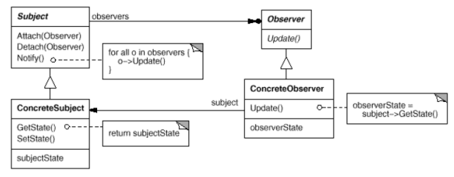
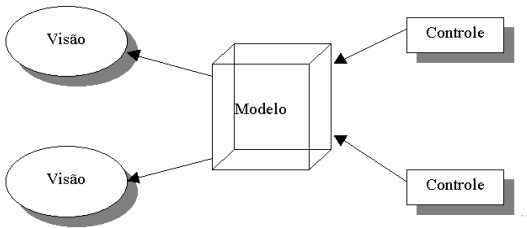
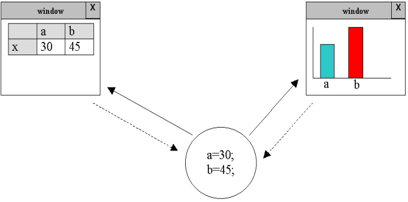

# Observer
Define uma dependência um-para-muitos entre objetos, de maneira que quando um objeto muda de estado, todos os seus dependentes são notificados e atualizados automaticamente. O objeto observável é um objeto que, quando sofre alguma alteração, notifica outros objetos, chamados de
“observadores”. Um exemplo disso é a camada visão do modelo MVC

- **Subject**: O que é observado. Permite a adição de observadores a serem notificados.

- **Observer**: O que é notificado quando algo ocorre no Subject. Ao ser notificado, o Observer pode acessar o subject e extrair alguma informação importante dele (para saber, por exemplo, qual tipo de evento aconteceu).

## Exemplo de uso
A utilização deste padrão de projeto facilita a implementação programas onde um modelo possui
várias visões que devem ser atualizadas toda vez que o modelo muda. O controle atua sobre o modelo, ocasionando alterações.

## Aplicabilidades
- Quando uma mudança em um objeto exige mudanças em outros, e você não sabe quantos objetos necessitam ser mudados;

- Quando um objeto deve ser capaz de notificar outros objetos sem usar informações sobre esses objetos. Ou seja, você não deseja que os objetos sejam fortemente acoplados.