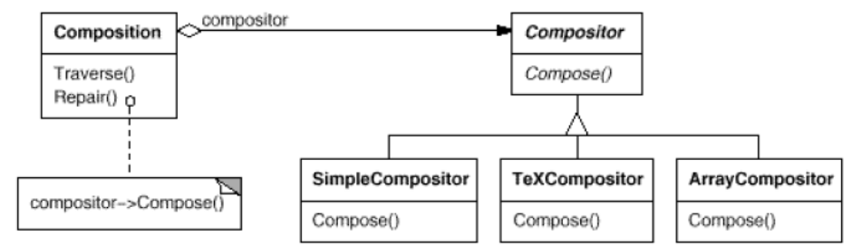
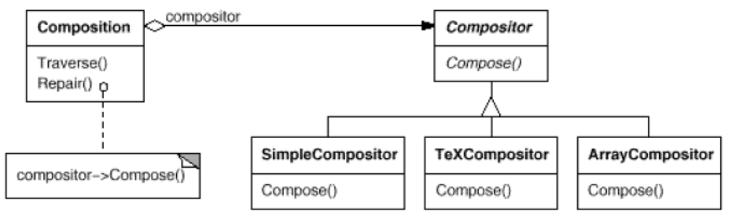
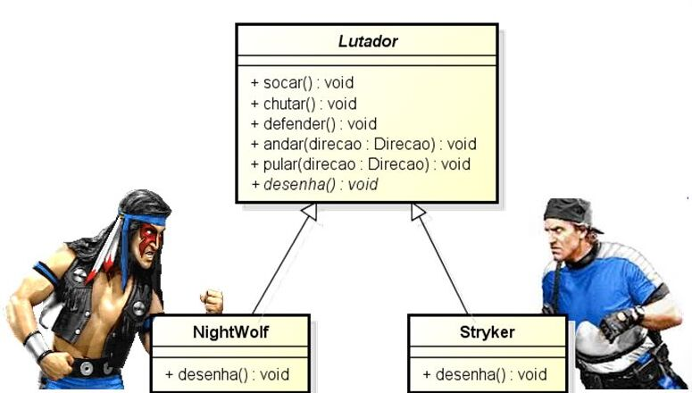

# Strategy
Utilizado quando o algoritmo a ser executado deve ser decidido em tempo de execução, ou seja, o padrão Strategy define uma família de algoritmos, encapsula cada um deles e torna-os intercambiáveis, permitindo assim que os algoritmos variem, independentemente dos clientes que os utilizam.



## Exemplo de uso
- Um programa que contém vários algoritmos para gerenciar quebra de linha (alg. simples,
alg. baseado no latex, alg. que tenta manter linhas com número igual de elementos).




Um outro exemplo de utilização poderia ser no desenvolvimento de um jogo, onde fosse possível determinar, dinamicamente, o comportamento de um personagem (como na imagem segunite):



Neste exemplo, sempre que novos personagens e novos comportamentos surgirem, o jogo estará pronto qualquer alteração.

## Aplicabilidades
- Muitas classes relacionadas se diferem apenas no comportamento. Ex: ```java.util.zip``` contém uma interface _Checksum_ que é implementada por dois algoritmos distintos para cálculo de checksum.

- Deseja-se diferentes variedades de um algoritmo. Ex: uma implementação que gasta muita memória (e pouco tempo) e outra implementação que gasta muito tempo (mas exige pouca memória); algoritmos para memória externa/interna.