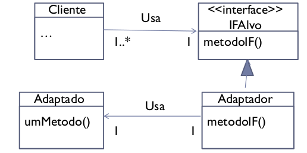

# Adapter
O padrão de projeto Adapter é necessário quando possuímos dois objetos que precisam se comunicar, mas as suas interfaces são diferentes. O adaptador é responsável por "converter" uma interface em outra tornando possível a comunicação entre os objetos.

Uma classe adaptadora implementa uma interface conhecida pelos clientes de modo a prover acesso a uma instância de uma classe não conhecida. Um objeto adaptador provê acesso à funcionalidade prometida pela interface sem ter que assumir qual classe é utilizada para implementar essa interface.

## Exemplos de uso
- Deseja-se utilizar uma classe que chama um método utilizando uma interface, mas a classe a ser utilizada não implementa a interface. Não se deseja modificar a classe, por algum motivo (como por exemplo, não se tem acesso ao código fonte ou a classe é de propósito geral e não se deseja que ela implemente uma interface para um motivo específico).
- Deseja-se determinar dinamicamente qual método de um objeto será chamado. É desejado que isso seja feito sem que o objeto chamador tenha conhecimento sobre a classe do outro objeto.

## Solução
O cliente chama o método através de um objeto que implemente a interface desejada chamando um (ou mais) método (s) do objeto que não implementa a interface.

Com isso, o cliente e a classe "adaptada" se mantêm independentes entre si.
