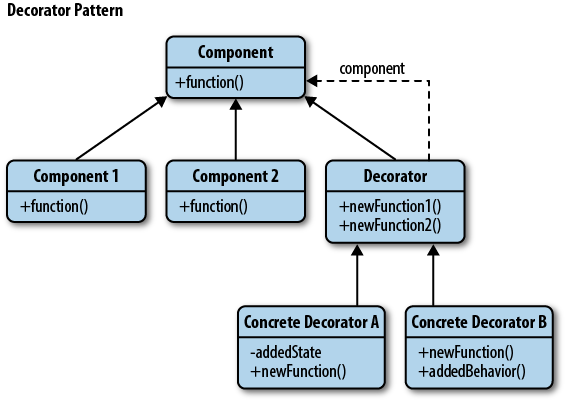

# Decorator
**Decorator** é um padrão de design estrutural que permite anexar novos comportamentos a objetos colocando esses objetos dentro de objetos *wrapper* especiais que contêm os comportamentos. Ou seja, adicionam responsabilidades dinamicamente a um objeto. Decoradores provêem uma alternativa flexível à herança para estender funcionalidade (permitem adicionar responsabilidades a um objeto e não a uma classe inteira). O ato de decorar, neste caso, não será o de "memorizar" e sim, "adicionar novos recursos" (**tenha isso em mente para facilitar o seu entendimento sobre o padrão**).


## Problema
Imagine que você esteja trabalhando em uma biblioteca de notificação, que permite com que outros programas notifiquem seus usuários sobre alguns eventos considerados importantes.

A versão inicial da biblioteca era baseada numa classe ```Notifier```, que tinha apenas alguns campos (um construtor e um único método ```send```). O método pode aceitar um argumento de mensagem de um cliente e enviar a mensagem para uma lista de e-mails que foram passados ​​para a classe notificadora por meio de seu construtor. Um outro programa de terceiros, que atuava como um cliente, deveria criar e configurar o objeto notificador uma vez e, em seguida, usá-lo sempre que algo importante acontecesse.


Em algum momento, os usuários da biblioteca podem passar a esperar mais do que apenas notificações por e-mail. Muitos deles gostariam de receber SMS sobre questões críticas. Outros gostariam de ser notificados em redes sociais, como Facebook e etc.


Uma alternativa seria criar subclasses especiais que combinam vários métodos de notificação em uma classe. No entanto, rapidamente essa abordagem iria sobrecarregar imensamente o código, não apenas o código da biblioteca, mas também o código do cliente, desde que as demandas por novos tipos de notificação apareçam.


## Solução
A utilização de um **wrapper** (um objeto que pode ser vinculado a algum objeto de destino) é uma solução. O wrapper contém o mesmo conjunto de métodos que o destino e delega a ele todas as solicitações que recebe. No entanto, o wrapper pode alterar o resultado fazendo algo antes ou depois de passar a solicitação para o destino. É por isso que, do ponto de vista do cliente, esses objetos são idênticos.


No caso, o último decorador na pilha seria o objeto com o qual o cliente realmente trabalha. Como todos os decoradores implementam a mesma interface do notificador base, o restante do código do cliente não se importará se funciona com o objeto notificador “puro” ou com o decorado.

## Diagrama de classes



## Exemplos
O ```JScrollPane``` da linguagem Java **decora** um componente GUI do Java, chamando o método
```paint```  do componente e adicionando a funcionalidade de “barra de rolagem”

```java
JTextArea area = new JTextArea(); //Cria um componente TextArea

//Cria um decorator de barra de rolagem embrulhando a TextArea
Component comp = new JScrollPane(area);

//Adiciona o componente “decorado” ao painel
getContentPane.add(comp);
```

 Um outro exemplo da utilização do padrão na própria linguagem Java é o ```BufferedReader```). O ```BufferedReader``` “decora” o ```FileReader``` com a funcionalidade de leitura "bufferizada". 

 ```java
 BufferedReader reader = new BufferedReader(new FileReader(“arquivo.txt"));
 ```

